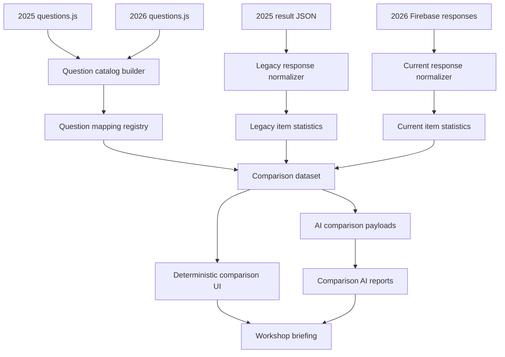

# 2025 하반기와 2026 상반기 워크샵 비교 분석 계획서

## 문서 관리

| 항목 | 내용 |
|---|---|
| 문서명 | 2025 하반기와 2026 상반기 워크샵 비교 분석 계획서 |
| 최초 작성일자 | 2026-05-13 |
| 업데이트일자 | 2026-05-13 |
| 업데이트 내용 | 최초 작성. 2025 문항/응답 JSON, 2026 문항 구조, 설문 비교 방법론 근거를 바탕으로 비교 분석 설계안 작성 |
| 작성 목적 | 2025년 4Q 워크샵 설문 결과와 2026년 2Q 워크샵 설문 결과를 어떤 기준과 절차로 비교할지 사전에 합의하기 위함 |
| 작성 범위 | 비교 설계, 데이터 정리 기준, 문항 매핑 기준, 정량/정성/AI 분석 설계, UI/리포트 구성, 위험 관리 |
| 비범위 | 실제 비교 기능 개발, Firebase 데이터 변경, GitHub Pages 배포, 최종 분석 실행 |

---

## 1. 의사결정 흐름 요약

1. 먼저 2025 워크샵 원천 자료를 확인했다. `workshop-2025-4Q-main/src/data/questions.js`는 총 49문항이며, 42개 5점 척도, 1개 선택형, 6개 서술형으로 구성되어 있었다. `workshop-2025-4Q-main/2025-4Q-result.json`에는 응답 10건이 있으나, 1건은 6문항만 응답한 부분 응답이어서 본 분석의 주 데이터셋은 `40문항 이상 응답한 9건`으로 보는 것이 합리적이다.
2. 다음으로 2026 워크샵 문항 구조를 확인했다. `workshop-2026-2Q-1/src/data/questions.js`는 총 104개 항목이며, 안내 페이지 7개를 제외한 응답 문항은 97개다. 이 중 78개는 `scale5na`, 9개는 단일 선택형, 3개는 복수 선택형, 7개는 서술형이다. 2026 설문은 역할/타팀 협업/CBT 관여 여부에 따라 일부 문항이 분기된다.
3. 두 설문은 같은 팀의 변화를 보려는 목적은 공유하지만, 동일 문항 반복 설문은 아니다. 2025는 “스쿼드 체제 전환 3개월 차 회고”, 2026은 “AI 사업부가 커지고 제품/직무가 늘어난 이후의 일하는 방식 점검”이다. 따라서 모든 문항을 단순 전년 대비 숫자로 비교하면 오해가 생긴다.
4. 방법론 근거를 확인한 결과, 변화 측정에서는 문항 wording, 맥락, 응답 방식이 유지될수록 해석력이 높고, 바뀌었을 경우에는 비교 등급과 주석을 붙여야 한다. 특히 소규모 조직 설문에서는 통계적 유의성보다 사람 수, 분포, 반복 신호, 행동 가능성이 더 중요하다.
5. 따라서 비교 방식은 하나의 큰 리포트로 뭉개지 않고, `문항 매핑 기반 정량 비교`, `축 단위 조직 변화 비교`, `서술형 목소리 변화 비교`, `전체 맥락 AI 해석`, `워크샵 실행 안건 도출`로 나누는 것이 맞다. 이 구조가 가장 투명하고, 비교 가능한 것과 비교하면 안 되는 것을 분리할 수 있다.

---

## 2. 핵심 결론

이번 비교는 “같은 질문의 점수가 올랐는가?”만 보는 작업이 아니다.

더 정확한 목표는 다음 네 가지다.

1. 2025년에 이미 보였던 신호가 2026년에 좋아졌는지, 유지되는지, 나빠졌는지 확인한다.
2. 문항이 바뀌어 직접 비교하기 어렵더라도, 같은 조직 과제의 흐름이 어떻게 변했는지 확인한다.
3. 2026년에 새로 생긴 제품, 직무, 외부 협업, 운영 복잡도가 어떤 새 문제를 드러내는지 확인한다.
4. 숫자와 서술형 응답을 함께 보되, 작은 표본에서 과도한 결론을 내리지 않고 워크샵에서 논의할 수 있는 안건으로 바꾼다.

가장 중요한 설계 원칙은 다음이다.

> 직접 비교할 수 있는 것은 직접 비교하고, 직접 비교할 수 없는 것은 “맥락 변화”로만 해석한다.

---

## 3. 근거 자료

### 3.1 로컬 원천 자료

| 구분 | 경로 | 확인 내용 |
|---|---|---|
| 2025 문항 정의 | `/Users/jkp/Library/CloudStorage/OneDrive-NURIMEDIACO.,LTD/전략기획팀/Code-new/workshop-2025-4Q-main/src/data/questions.js` | 49문항, 16개 섹션, 42개 척도형, 1개 선택형, 6개 서술형 |
| 2025 응답 데이터 | `/Users/jkp/Library/CloudStorage/OneDrive-NURIMEDIACO.,LTD/전략기획팀/Code-new/workshop-2025-4Q-main/2025-4Q-result.json` | 응답 10건. 그중 1건은 6문항만 응답한 부분 응답. 40문항 이상 응답 기준 유효 응답 9건 |
| 2026 문항 정의 | `/Users/jkp/Library/CloudStorage/OneDrive-NURIMEDIACO.,LTD/전략기획팀/Code-new/workshop-2026-2Q-1/src/data/questions.js` | 총 104항목, 응답 문항 97개, 7개 안내 페이지, 역할/외부협업/CBT 분기 포함 |
| 2026 축 정의 | 같은 파일의 `axisMap` | 10개 분석 축: 팀 안전감과 몰입, 사업 목표와 제품 우선순위, 고객/사용자 의견, 요구사항, 결정 방식, 역할 간 협업, 제품별 운영, 개발/운영 환경, 지식 공유, 학습 문화 |
| 2026 AI 분석 구조 | `/Users/jkp/Library/CloudStorage/OneDrive-NURIMEDIACO.,LTD/전략기획팀/Code-new/workshop-2026-2Q-1/src/utils/openaiAnalysis.js` | 현재 5종 리포트: 한 장의 편지, 직무별 메시지, 종합, 선택형, 서술형 |

### 3.2 외부 방법론 근거

| 출처 | 비교 설계에 반영한 원칙 |
|---|---|
| [AAPOR Best Practices for Survey Research](https://aapor.org/standards-and-ethics/best-practices/) | 변화 측정은 문항 wording, 프레이밍, 조사 방식이 유지될수록 타당하다. 달라진 경우에는 변화 해석을 신중히 해야 한다. 부분 응답과 무응답은 별도 값으로 다뤄야 하며, 표본/문항/응답 방식의 투명한 공개가 필요하다. |
| [Pew Research Center - Writing Survey Questions](https://www.pewresearch.org/writing-survey-questions/) | 작은 wording 차이도 응답 차이를 만들 수 있다. 비교 문항은 단어, 응답 선택지, 앞뒤 맥락의 차이를 검토해야 한다. |
| [Culture Amp - Statistical Significance in Employee Surveys](https://support.cultureamp.com/en/articles/7048398-statistical-significance-in-employee-surveys) | 직원 설문에서는 통계적 유의성만으로 해석하면 특히 소규모 팀에서 오해가 생길 수 있다. 차이를 사람 수와 행동 가능성 중심으로 읽는 편이 실무적으로 낫다. |
| [BMC Medical Research Methodology - Time and change in qualitative longitudinal research](https://bmcmedresmethodol.biomedcentral.com/articles/10.1186/s12874-023-02105-1) | 정성 비교는 단순 주제 나열이 아니라 시간에 따른 변화가 어떻게 드러나는지 구조화해야 한다. |
| [Gioia Methodology 개요](https://sustainabilitymethods.org/index.php/Gioia-Methodology) | 서술형 응답은 원문 표현을 1차 개념으로 존중하고, 이를 2차 주제와 상위 차원으로 올리는 방식이 추적 가능성과 엄밀성을 높인다. |

---

## 4. 비교의 기본 성격

### 4.1 이 비교는 패널 추적 조사가 아니다

2025와 2026은 동일 개인을 식별해 전후 변화를 추적하는 패널 조사가 아니다. 2025 응답자 ID가 임의 문자열이고, 2026 설문도 익명성을 우선한다. 따라서 “박준기 개인의 인식이 어떻게 바뀌었는가” 같은 분석은 하면 안 된다.

권장 해석 단위는 다음이다.

| 해석 단위 | 사용 여부 | 이유 |
|---|---:|---|
| 개인별 변화 | 사용하지 않음 | 동일 개인 매칭이 불가능하고 익명성 목적에도 맞지 않음 |
| 팀 전체 스냅샷 변화 | 사용 | 두 시점의 조직 상태를 비교하는 목적에 부합 |
| 문항별 평균 변화 | 제한적으로 사용 | 문항 wording과 맥락이 유사한 경우에만 가능 |
| 축 단위 변화 | 사용 | 문항이 완전히 같지 않아도 조직 과제의 방향성을 읽을 수 있음 |
| 역할별 변화 | 매우 제한적으로 사용 | 2025에는 역할 메타데이터가 없어 직접 비교 불가. 2026 내부 해석에만 사용 |

### 4.2 이 비교는 “동일 설문 반복”이 아니라 “조직 진화 비교”다

2025 설문은 스쿼드 전환 초기의 건강 상태를 보려는 성격이 강했다. 심리적 안전감, 역할 명확성, 미션 정렬, 협업, 자율성, 회의, 학습, 지속 가능성 등 애자일/스쿼드 전환의 기본 항목이 많다.

2026 설문은 제품 수, 역할, 타팀 협업, 운영/개발 환경이 늘어난 상태를 반영한다. AI Agent, AI Viewer, AI Idea, AI Reader, AI Editor, PM/프롬프트/AI/BE/FE, 디자인/인프라/영업/마케팅 협업, CBT와 정식 운영 제품의 차이 같은 항목이 들어갔다.

따라서 비교의 중심 질문은 다음이어야 한다.

| 질문 | 이유 |
|---|---|
| 스쿼드 초기에 보였던 강점은 커진 조직에서도 유지되는가? | 2025 강점이 2026 운영 복잡도 속에서도 유지되는지 확인 |
| 2025의 약점은 해소되었는가, 아니면 형태만 바뀌어 남아 있는가? | 같은 문제가 다른 이름으로 반복될 수 있음 |
| 2026에 새로 드러난 문제는 무엇인가? | 새 직군, 새 제품, 외부 협업 증가로 새 병목이 생겼을 가능성 |
| 숫자로 비교할 수 없는 변화는 어떻게 이야기로 설명할 것인가? | 문항 변경과 조직 맥락 변경을 감안한 해석 필요 |

---

## 5. 데이터 정리 원칙

### 5.1 2025 응답 유효성 기준

2025 JSON에는 응답 10건이 있다. 단, 1건은 Q1~Q6까지만 응답되어 있어 전체 비교에 포함하면 평균과 분포를 왜곡할 수 있다.

권장 기준은 다음이다.

| 기준 | 처리 | 근거 |
|---|---|---|
| 40문항 이상 응답 | 주 분석 포함 | 2025 필수 문항 46개 중 대부분을 답한 응답으로 볼 수 있음 |
| 7~39문항 응답 | 보조 분석 후보 | 특정 섹션만 분석할 때 사용할 수 있으나 본 비교에는 부적합 |
| 6문항 이하 응답 | 제외 | 부분 응답으로 인한 왜곡 위험이 큼 |
| 이상한 길이의 응답 ID | ID 자체로 제외하지 않음 | 익명 ID는 품질 기준이 아니며, 응답 완성도와 패턴으로 판단해야 함 |
| 일괄 동일 응답 패턴 | 추가 점검 | 테스트 응답 가능성이 있으므로 응답 시간, 텍스트 내용, 분산을 함께 확인 |

2025 본 분석의 기본 표본은 `n=9`로 잡는다.

단, 각 문항별 `n`은 다르게 표시해야 한다. 예를 들어 2025 선택 기술문항 OPT1~OPT3은 응답자 수가 5~7명으로 다르다.

### 5.2 2026 응답 유효성 기준

2026은 실제 워크샵 전 테스트 데이터와 본 응답 데이터가 섞일 가능성이 있다. 따라서 비교 분석을 시작하기 전에 다음 기준이 필요하다.

| 기준 | 처리 | 이유 |
|---|---|---|
| 데이터 동결 시각 | 필수 기록 | 어느 시점까지의 응답을 분석했는지 추적 가능해야 함 |
| 테스트 응답 | 제외 | 테스트셋 10~15건이 이미 생성된 이력이 있으므로 본 응답과 섞이면 안 됨 |
| 설문 제출 완료 여부 | 주 분석 포함 조건 | 중간 저장 데이터가 본 응답에 들어가면 안 됨 |
| 역할별 분기 응답 | 문항별 `eligible n`과 `answered n` 분리 | 모든 사람이 모든 문항을 본 것이 아니므로 단순 무응답으로 보면 안 됨 |
| `NA` 응답 | 평균 계산에서 제외하고 별도 비율 표시 | `해당 없음 / 판단하기 어려움`은 낮은 점수가 아니라 정보 접근성 또는 경험 부재 신호일 수 있음 |

### 5.3 척도 방향 정리

2025 문항 대부분은 점수가 높을수록 긍정적이다. 그러나 Q21은 주의가 필요하다.

| 문항 | 원문 의미 | 위험 |
|---|---|---|
| 2025 Q21 외부 의존성 관리 | “다른 팀이나 부서와의 의존성으로 인해 업무가 지연되는 경우가 얼마나 자주 발생합니까?” | 점수가 높을수록 지연이 잦다는 뜻으로 해석될 수 있어, 다른 문항과 방향이 반대일 가능성이 있음 |

따라서 비교 엔진에는 `direction` 필드를 둔다.

| direction | 의미 | 계산 |
|---|---|---|
| `higher_is_better` | 높은 점수일수록 건강 | 원점수 사용 |
| `higher_is_worse` | 높은 점수일수록 문제 | 건강 점수 계산 시 `6 - value` 사용 |
| `unknown` | 방향 불명확 | 평균 변화 대신 분포와 원문 중심 해석 |

Q21은 원점수와 변환 점수를 모두 보존해야 한다. 리포트에서는 “외부 지연 빈도”라는 문제 신호로 읽고, 건강 점수 합산에는 변환 점수를 사용한다.

---

## 6. 문항 매핑 등급

비교에서 가장 중요한 산출물은 문항 매핑표다. 이 매핑표 없이는 AI 분석도 숫자 비교도 신뢰하기 어렵다.

### 6.1 매핑 등급 정의

| 등급 | 이름 | 기준 | 숫자 비교 | AI 비교 |
|---|---|---|---|---|
| M0 | 동일 문항 | wording, 응답 방식, 시간 기준, 앞뒤 맥락이 거의 동일 | 가능 | 가능 |
| M1 | 강한 유사 문항 | 같은 구성개념을 묻고 5점 척도 방향도 유사하나 wording 또는 맥락이 일부 다름 | 제한적으로 가능 | 가능 |
| M2 | 중간 연결 문항 | 같은 조직 과제를 보지만 문항이 분해/통합되었거나 응답 방식이 다름 | 평균 직접 비교는 지양, favorable 비율 또는 축 단위 비교 | 가능 |
| M3 | 정성/맥락 비교 | 숫자 비교는 어렵지만 같은 주제의 서술형/맥락 해석 가능 | 불가 | 가능 |
| M4 | 비교 불가/신규 문항 | 2026에 새로 생겼거나 2025에만 있던 항목 | 불가 | 전체 맥락 설명에만 사용 |

### 6.2 매핑 상태값

| 상태 | 의미 |
|---|---|
| `candidate` | 자동/초기 매핑 후보 |
| `reviewed` | 사람이 검토했으나 최종 확정 전 |
| `approved` | 비교 리포트에 사용 가능 |
| `rejected` | 유사해 보이나 비교하지 않기로 결정 |

### 6.3 매핑 레지스트리 필드

추후 구현 시 별도 파일로 다음 구조를 권장한다.

파일 후보:

`/Users/jkp/Library/CloudStorage/OneDrive-NURIMEDIACO.,LTD/전략기획팀/Code-new/workshop-2026-2Q-1/05_comparison_planning/02_question_mapping_registry.csv`

필드:

| 필드 | 설명 |
|---|---|
| `mapping_id` | 매핑 고유 ID |
| `legacy_question_id` | 2025 문항 ID |
| `current_question_ids` | 연결되는 2026 문항 ID 목록 |
| `comparison_level` | M0~M4 |
| `construct` | 비교 축 |
| `legacy_direction` | 2025 척도 방향 |
| `current_direction` | 2026 척도 방향 |
| `numeric_comparison_allowed` | 숫자 직접 비교 가능 여부 |
| `ai_comparison_allowed` | AI 해석 비교 포함 여부 |
| `rationale` | 왜 연결했는지 |
| `caveat` | 어떤 주의가 필요한지 |
| `status` | candidate/reviewed/approved/rejected |

---

## 7. 비교 축 설계

2026의 `axisMap`을 기준으로 삼되, 2025 섹션을 함께 흡수하는 형태가 적절하다. 이유는 2026 설문이 현재 조직 상태에 맞게 더 세분화되어 있고, 향후 기능 개발도 2026 앱 구조 안에서 이뤄질 가능성이 높기 때문이다.

### 7.1 권장 비교 축

| 비교 축 | 2025 근거 | 2026 근거 | 선택 이유 |
|---|---|---|---|
| 팀 안전감과 말할 수 있는 분위기 | Q1~Q4, Q14, Q37 | PS01~PS04, EN08, I03 | 스쿼드의 기본 신뢰와 솔직함이 유지되는지 확인 |
| 역할과 책임, 끝까지 챙김 | Q5~Q7, Q17 | D01, D04, E01~E03, 역할별 문항 | 조직이 커질수록 모호성이 커지는 핵심 영역 |
| 목표와 제품 우선순위 | Q8~Q10, Q29~Q31, Q38~Q39 | A01~A05, CHOICE02, CHOICE03 | 2026에는 제품 포트폴리오가 커져 가장 중요한 비교 축 |
| 고객/사용자 신호 반영 | Q15, Q29~Q30 | B01~B05, PM03, EXT03 | 2025에는 약하게 묻던 영역이 2026에는 핵심화됨 |
| 요구사항과 문제 정의 | Q32, Q15, Q19 | C01~C05, PM01~PM04 | 미니 워터폴과 요구사항 품질 변화를 함께 봄 |
| 결정 방식과 업무 집중 | Q16~Q18, Q20, Q22 | D01~D06 | 속도, 권한, 기록, 동시 진행 과다를 한 축으로 봄 |
| 역할 간 협업과 타팀 협업 | Q11~Q14, Q21, Q24~Q25, OPT1 | E01~E06, EXT01~EXT03, CHOICE04 | 내부 직군 협업과 외부 협업을 분리해서 보되 한 챕터 안에 배치 |
| 제품별 운영 방식 | 2025에는 직접 문항 거의 없음 | F01~F05, CBT01~CBT04 | 2026에 새로 중요해진 축. 직접 전년 비교보다 신규 리스크로 해석 |
| 개발/운영 환경과 기술 품질 | OPT1~OPT3, Q21 | G01~G05, AI01~AI04, WEB01~WEB04 | 2025 선택 문항을 2026 개발/운영 문항과 연결 |
| 지식 공유와 새 구성원 적응 | Q13, Q26~Q28 | H01~H04 | 신규 합류자가 늘어난 2026 맥락에서 신규 축으로 봄 |
| 지속 가능한 속도와 학습 | Q27, Q33~Q36 | I01~I04, EN01~EN04 | 2025의 빠른 속도/피로 신호가 2026에도 남았는지 확인 |

### 7.2 축별 비교 방식

| 축 | 주 비교 방식 | 이유 |
|---|---|---|
| 팀 안전감 | 문항 매핑 + 평균/분포 변화 | 2025와 2026에 유사 문항이 많음 |
| 역할/책임 | 문항 매핑 + 서술형 해석 | wording이 많이 바뀌었고 2026은 역할별 분기 포함 |
| 목표/우선순위 | 축 단위 비교 + AI 해석 | 2026 제품 포트폴리오 맥락이 커졌기 때문 |
| 고객/사용자 신호 | 신규 심화 축으로 해석 | 2025에는 직접성이 약해 전년 대비 평균 비교는 제한적 |
| 요구사항 | M1/M2 문항 일부 비교 | 미니 워터폴, 문제 정의, 완료 기준이 연결됨 |
| 결정/집중 | 문항 매핑 + 선택형 우선순위 | 2026 CHOICE 문항이 실행 안건 도출에 중요 |
| 협업 | 내부 협업과 외부 협업 분리 | 2026에는 디자인/인프라/영업/마케팅 등 외부 접점이 명확해짐 |
| 제품 운영 | 신규 축 | 2025에는 직접 비교 기준이 거의 없음 |
| 개발/운영 | 기술 선택 문항과 2026 개발 문항 연결 | 2025 OPT 응답 수가 적어 보조 신호로만 사용 |
| 지식 공유 | 신규/확장 축 | 2025 정보 공유와 학습 문항을 약하게 연결 |
| 지속 가능성 | 직접 비교 가능성 높음 | 2025 Q33~Q36과 2026 I01/EN 계열 연결 가능 |

---

## 8. 초기 문항 매핑 후보

아래 표는 최종 매핑이 아니라 계획 단계의 후보 매핑이다. 실제 구현 전에는 `02_question_mapping_registry.csv`로 옮겨 검토/확정해야 한다.

| 2025 ID | 2025 문항 요지 | 2026 후보 | 등급 | 판단 근거 및 주의점 |
|---|---|---|---|---|
| Q1 | 실수/위험 감수 안전감 | PS01, PS02, PS03 | M1 | 2026이 실수 공유, 까다로운 이슈, 새 시도 안전감으로 분해함. 평균 직접 비교는 2026 3문항 평균과 비교하는 방식이 적절 |
| Q2 | 무비난 문화 | I03, E06 | M1 | 실패를 개인 탓보다 학습/구조로 보는지 묻는 동일 축. 2026은 더 자연어화됨 |
| Q3 | 의견 제시의 자유 | PS02, EN08 | M1 | 의견을 말할 수 있는지와 의견이 진지하게 다뤄졌는지를 함께 봐야 함 |
| Q4 | 다양성의 실질적 활용 | PS04, EN06, E06 | M2 | 2026에는 “특정 직군이 지배하지 않는가”를 직접 묻지 않음. 강점 활용/결정 공정성/구조적 논의로만 간접 비교 |
| Q5 | 역할과 책임 명확성 | D04, D01, E01~E03 | M2 | 2026은 일반 R&R보다 결정권/끝까지 챙김/역할 간 합의로 세분화됨 |
| Q6 | 전담 오너 명확성 | D04, D01 | M1 | 책임자/최종 결정자 명확성으로 비교 가능 |
| Q7 | 강점 발휘 기회 | PS04 | M1 | 고유 역량 활용과 거의 같은 구성개념 |
| Q8 | 미션 명확성과 회사 AI 전략 연결 | A01, A03, EN03, EN10 | M2 | 2026은 AI 사업부 목표/업무 연결/다음 분기 방향으로 나뉨 |
| Q9 | 성공 지표 명확성 | A04, C01 | M1 | 제품 성공 기준과 문제/성공 기준 정의로 비교 가능 |
| Q10 | 회사 비전과 목표 일치 | A01, A03 | M2 | 2026은 회사 비전보다 AI 사업부 목표와 제품 목표 중심 |
| Q11 | 직군 간 협업 원활함 | C02, E01, E02, E03 | M2 | 2026은 직군 간 협업을 인터페이스별로 분해 |
| Q12 | 신뢰와 소통 | EN02, EN09, PS01 | M2 | 2026은 연결감/어려움 공유/안전감으로 분해 |
| Q13 | 중요 정보/결정 공유 적시성 | A05, D03, H03 | M2 | 2026은 우선순위 변경 공유, 결정 기록, 조직 기억으로 나뉨 |
| Q14 | 갈등 해결의 건설성 | E06, I03 | M1 | 책임 공방보다 구조/학습을 보는지와 연결 |
| Q15 | 데이터/실험 기반 의사결정 | B05, A04, AI01 | M2 | 2025 문항은 리더 직관/외부 압박과 대비하는 강한 표현. 2026은 사용자 문제/성공 기준/AI 변경 결과 공유로 분해 |
| Q16 | 의사결정 속도 | D02, D05 | M2 | 2026은 속도 자체보다 참여 범위와 지연 해소 능력을 봄 |
| Q17 | 의사결정 권한 명확성 | D01 | M1 | 2025는 예/아니오/모름, 2026은 5점 척도. 평균 비교보다 favorable 비율 비교 권장 |
| Q18 | 자율성과 주도권 | EN07 | M1 | 업무 수행 방식의 자율성과 직접 연결 |
| Q19 | 업무 프로세스 적합성 | I02, C05, D06 | M3 | 2026에 동일한 일반 프로세스 문항은 없음. 운영 개선 실행/완료 기준/동시 진행 문제로만 맥락 비교 |
| Q20 | 업무 처리 속도 | D05, D06, I02 | M2 | 2026은 속도 만족보다 막힘 해소, WIP, 실행 연결로 구체화 |
| Q21 | 외부 의존성으로 인한 지연 | E05, EXT02, CHOICE04 | M2 | 2025 문항은 방향 반전 가능성이 있어 원점수 직접 비교 금지. 외부 협업 병목 신호로 해석 |
| Q22 | 회의 효율성 | D02, D06, CHOICE02 | M3 | 2026은 회의 자체를 직접 묻지 않고 결정 범위/WIP/회의 줄이기 선택지로 간접 확인 |
| Q23 | 리더의 비전/지원 | EN10, A01 | M3 | 2026은 팀장/리드 평가를 의도적으로 제거했으므로 직접 비교하지 않음 |
| Q24 | 다른 팀/조직으로부터 지원 | EXT01, EXT02, CHOICE04 | M2 | 외부 협업 요청 정보/조기 확인/개선 대상과 연결 |
| Q25 | 상위 조직/타부서의 이해와 지원 | B03, EXT03 | M2 | 관련 팀 의견 정리와 타팀 의견 반영으로 연결 |
| Q26 | 학습 기회 | H02, I03, EN01 | M3 | 2026은 교육/성장보다 배경지식 접근과 학습 문화에 초점 |
| Q27 | 실패를 통한 학습 | I03, F05 | M1 | 실패/품질 문제 학습, 제품 간 배운 점 공유와 연결 |
| Q28 | 역량 개발 지원 | H01, H02 | M3 | 2026은 신규 합류/제품 배경지식 중심. 교육/코칭과 직접 동일하지 않음 |
| Q29 | 일정 준수보다 고객 가치 | B05, A04 | M2 | Outcome 중심성과 제품 성공 기준으로 연결 |
| Q30 | 결과물의 고객/이해관계자 가치 | A04, B02 | M2 | 제품 성공 기준과 실제 사용자 의견 전달로 간접 비교 |
| Q31 | 스쿼드 구조의 효율성 | NPS01, I04 | M3 | 2026은 구조 만족도를 직접 묻지 않음. 팀 추천 의향/워크샵 효능감으로만 참고 |
| Q32 | 미니 워터폴이 아닌 진정한 협업 | C02, E01~E03 | M1 | 필요한 역할 조기 참여와 역할 간 합의로 비교 가능 |
| Q33 | 지속 가능한 업무 강도 | I01 | M1 | 거의 직접 비교 가능 |
| Q34 | 업무 분배와 지속 가능성 | I01, D06, EN05 | M2 | 지속 가능성, 동시 진행 과다, 기여 인정 공정성으로 분해 |
| Q35 | 함께 일하는 즐거움 | EN01, EN02 | M2 | 2026은 즐거움보다 의미/연결감으로 표현 |
| Q36 | 하나의 팀으로 결속 | EN02 | M1 | 팀 연결감과 직접 연결 가능 |
| Q37 | 개선 제안의 수용 | EN08, I02, I04 | M2 | 의견이 다뤄진 경험, 개선 실행, 워크샵에서 바꿀 수 있는지와 연결 |
| Q38 | 스쿼드 재편 목적 이해 | A01, EN10 | M2 | 2026은 재편 목적이 아니라 현재 AI 사업부 목표/다음 분기 방향 |
| Q39 | 스쿼드 체제 만족도 | NPS01, I04 | M3 | 조직 체제 만족도와 팀 추천/워크샵 효능감은 같지 않음 |
| Q40 | 기능 조직 대비 신뢰 비용 감소 | EN02, D03, H03 | M3 | 신뢰 비용을 직접 묻지 않음. 연결감/기록/조직 기억으로만 맥락 비교 |
| Q41 | Keep | TEXT01 | M1 | 유지할 점 서술형으로 직접 비교 가능 |
| Q42 | Problem | TEXT02 | M1 | 답답한 점/개선점으로 직접 비교 가능 |
| Q43 | Try | TEXT04 | M1 | 다음 4주 실험 제안으로 직접 비교 가능 |
| Q44 | 하나를 즉시 바꾼다면 | TEXT03 | M1 | 마법의 지팡이 표현만 달라졌고 의도는 유사 |
| Q45 | 여정의 표현 | TEXT05 | M3 | 2026에 은유형 문항은 없음. 정서 톤 비교에만 보조 사용 |
| Q46 | 슈퍼히어로 강점/약점 | TEXT01, TEXT02, TEXT05 | M3 | 강점/약점 구조는 비교 가능하나 같은 질문은 아님 |
| OPT1 | AI와 웹 엔지니어 협업 | E02, E03, AI04, WEB01 | M2 | 2026은 AI-BE, BE-FE, AI-PM/BE 책임 범위를 세분화 |
| OPT2 | 기술 부채와 단기 성과 균형 | G04, WEB04, CBT03 | M1 | 기술 문제와 사업 요구 균형은 직접 연결 가능 |
| OPT3 | 코드베이스/기술 품질 | G01, G03, G05, WEB03 | M2 | 코드베이스 건전성 자체는 없고 운영/변경 영향/공통 체계로 분해 |

---

## 9. 정량 비교 설계

### 9.1 기본 지표

척도형 문항에는 다음 지표를 사용한다.

| 지표 | 정의 | 사용 이유 |
|---|---|---|
| `n_answered` | 해당 문항에 실제 응답한 사람 수 | 작은 표본에서는 n 표시가 필수 |
| `mean` | 평균 점수 | 변화 방향을 빠르게 보기 위한 기본값 |
| `median` | 중앙값 | 극단값 영향을 줄여 보기 위함 |
| `favorable_count` | 4 또는 5 응답 수 | 사람 수 기준으로 보기 쉬움 |
| `favorable_rate` | 4 또는 5 비율 | 평균보다 실무자가 이해하기 쉬운 경우가 많음 |
| `low_count` | 1 또는 2 응답 수 | 위험 신호를 사람 수로 표시 |
| `neutral_count` | 3 응답 수 | 애매함/판단 보류 구간 |
| `na_count` | 2026 NA 응답 수 | 경험 부재와 정보 접근성 부족을 별도 신호로 봄 |
| `distribution` | 1~5 분포 | 평균이 숨기는 양극화 확인 |

### 9.2 변화량 지표

문항 매핑이 M1 또는 일부 M2인 경우에만 변화량을 계산한다.

| 지표 | 계산 | 해석 |
|---|---|---|
| 평균 변화 | `2026 mean - 2025 mean` | 단, 문항 등급과 caveat를 함께 표시 |
| favorable 변화 | `2026 favorable_rate - 2025 favorable_rate` | 작은 팀에서는 평균보다 직관적 |
| low 응답 변화 | `2026 low_rate - 2025 low_rate` | 위험 신호가 줄었는지 확인 |
| 사람 수 변화 | `2026 favorable_count - 2025 favorable_count` | “몇 명이 다르게 느끼는가”로 읽기 |
| 분포 변화 | 1~5 막대 비교 | 평균만으로 숨겨지는 양극화 확인 |

### 9.3 변화 판정 기준

소규모 조직 설문에서 엄격한 통계적 유의성은 적절하지 않다. 대신 다음처럼 방향 신호로 판정한다.

| 판정 | 조건 예시 | 표현 방식 |
|---|---|---|
| 뚜렷한 개선 신호 | 평균 +0.40 이상 또는 favorable +25%p 이상, low 감소 동반 | “개선 신호가 비교적 뚜렷함” |
| 약한 개선 신호 | 평균 +0.20~+0.39 또는 favorable +10~24%p | “개선 가능성이 보임” |
| 유지/큰 변화 없음 | 평균 -0.19~+0.19, favorable 변화 ±10%p 이내 | “큰 변화는 확인되지 않음” |
| 약한 악화 신호 | 평균 -0.20~-0.39 또는 favorable -10~-24%p | “주의 신호가 보임” |
| 뚜렷한 악화 신호 | 평균 -0.40 이하 또는 favorable -25%p 이하, low 증가 동반 | “우선 확인이 필요함” |
| 불확실 | n이 너무 작거나 M2 이하 | “비교 근거가 제한적임” |

이 기준은 기계적 결론이 아니라 리포트의 시작점이다. 최종 해석에는 서술형 응답과 2026 선택형 병목 문항을 함께 봐야 한다.

### 9.4 평균 직접 비교를 피해야 하는 경우

다음 조건에서는 평균 변화 숫자를 메인 결론으로 쓰지 않는다.

| 조건 | 예 |
|---|---|
| 문항 wording이 크게 다름 | 2025 Q23 리더 지원 vs 2026 AI 사업부 목표 이해 |
| 응답 방식이 다름 | 2025 Q17 예/아니오/모름 vs 2026 D01 5점 척도 |
| 2026 문항이 역할 분기 문항 | PM01, AI01, WEB01 등 |
| 2025 문항이 선택형 기술 문항이라 n이 작음 | OPT1~OPT3 |
| 2025 문항 방향이 반대 가능성 | Q21 |
| 2026에 NA가 많음 | 경험하지 않은 사람이 많아 평균이 해석을 흐릴 수 있음 |

---

## 10. 정성 비교 설계

### 10.1 비교 대상

| 2025 | 2026 | 비교 가능성 |
|---|---|---|
| Q41 Keep | TEXT01 유지할 점 | 높음 |
| Q42 Problem | TEXT02 개선이 필요한 점 | 높음 |
| Q43 Try | TEXT04 4주 실험 | 높음 |
| Q44 마법의 지팡이 | TEXT03 하나만 바로 바꾼다면 | 높음 |
| Q45 여정의 표현 | 직접 대응 없음 | 정서/은유 톤 참고 |
| Q46 초능력/약점 | TEXT01/TEXT02/TEXT05 | 강점/약점 구조 참고 |
| 없음 | TEXT05 설문에서 빠진 중요한 내용 | 2026 신규 위험 탐색 |

### 10.2 분석 방식

서술형은 모든 응답을 넣되, 개인 식별 위험을 줄이기 위해 원문 공개는 제한한다.

권장 절차:

1. 각 시점의 서술형을 문항별로 분리한다.
2. 응답 원문에서 1차 개념을 뽑는다. 이 단계에서는 응답자의 표현을 최대한 존중한다.
3. 1차 개념을 2차 주제로 묶는다.
4. 2차 주제를 상위 축으로 정리한다.
5. 2025와 2026을 비교해 다음 네 범주로 나눈다.
   - 계속 남아 있는 주제
   - 약해진 주제
   - 강해진 주제
   - 새로 등장한 주제
6. 각 주제마다 대표 문장을 만들되, 개인 식별 가능 표현은 제거한다.
7. AI 리포트에는 “응답 몇 건에서 반복됨” 정도만 쓰고, 실명/특정 개인 추정은 금지한다.

### 10.3 정성 비교의 핵심 질문

| 질문 | 분석 목적 |
|---|---|
| 2025의 빠른 속도, 피로, 인력 부족 신호가 2026에도 반복되는가? | 일하는 속도와 지속 가능성 비교 |
| 2025의 신뢰/자유로운 발언 강점이 2026에도 유지되는가? | 문화 강점의 지속 여부 |
| 2026에는 우선순위, 제품 운영, 타팀 협업, 지식 공유 같은 새 언어가 늘었는가? | 조직 복잡도 증가 확인 |
| 2025에는 “스쿼드 전환”이 중심이고 2026에는 “제품 포트폴리오 운영”이 중심인가? | 문제의 성격 변화 확인 |
| 응답자들이 원하는 해결책이 2025에는 인력/속도 중심, 2026에는 기준/정렬/운영 체계 중심으로 이동했는가? | 워크샵 안건의 변화 확인 |

---

## 11. AI 비교 분석 설계

AI 분석은 숫자를 대신 판단하는 장치가 아니라, 매핑된 데이터와 서술형 응답을 사람이 읽기 쉬운 구조로 정리하는 보조 분석가로 사용해야 한다.

### 11.1 권장 AI 리포트 종류

| 리포트 | 목적 | 입력 데이터 | 출력 |
|---|---|---|---|
| 비교 종합 리포트 | 2025와 2026의 조직 변화 전체를 해석 | 축별 통계, 주요 선택형 결과, 서술형 테마 | Executive Summary, 변한 것/유지된 것/새로 보인 것/주의할 것 |
| 매칭 문항 변화 리포트 | 유사 문항의 변화만 엄밀하게 해석 | M1/M2 문항 매핑표와 문항별 통계 | 문항별 변화, 비교 등급, 해석 주의점 |
| 축별 변화 리포트 | 조직 운영 축 단위로 변화 설명 | 비교 축 통계, 2026 axisMap, 2025 섹션 연결 | 축별 한 문장 정리, 해석, 워크샵 질문 |
| 서술형 목소리 변화 리포트 | 응답자의 언어가 어떻게 바뀌었는지 분석 | 2025 Q41~Q46 전체, 2026 TEXT01~TEXT05 전체 | 반복 주제, 사라진 주제, 새 주제, 대표 익명 문장 |
| 워크샵 실행 안건 리포트 | 비교 결과를 워크샵 분과 토론으로 전환 | 위 4개 분석 결과 요약 | 우선 안건 3~5개, 분과별 질문, 4주 실험 후보 |

### 11.2 프롬프트 공통 원칙

모든 비교 AI 프롬프트에는 다음 규칙을 넣어야 한다.

1. 비교 등급 M0~M4를 반드시 반영한다.
2. M3/M4 문항을 숫자로 직접 비교하지 않는다.
3. 작은 표본이므로 통계적 유의성 표현을 쓰지 않는다.
4. `n`, 문항 wording 차이, 응답 방식 차이를 함께 언급한다.
5. 2025 응답은 스쿼드 전환 초기 맥락, 2026 응답은 AI 사업부 확장 맥락으로 해석한다.
6. “개선됐다/악화됐다”를 단정하기 전에 “비교 가능한 근거가 충분한지”를 먼저 확인한다.
7. 리포트는 다음 구조를 따른다.
   - 한 문장 결론
   - Executive Summary
   - 근거가 강한 변화
   - 근거가 제한적인 변화
   - 새로 등장한 주제
   - 워크샵에서 물어볼 질문
   - 4주 안에 해볼 수 있는 작은 실험
8. 개인, 특정 직무, 특정 팀을 평가하는 표현을 피한다.
9. 서술형은 특정 개인이 드러나는 문장을 그대로 길게 인용하지 않는다.
10. 결과가 불편하더라도 완곡하게 숨기지 않고, 근거 수준을 표시해 솔직하게 말한다.

### 11.3 리포트별 세부 프롬프트 방향

#### 비교 종합 리포트

목적:

두 시점의 조직 상태를 한 번에 이해하게 한다.

반드시 포함:

- 2025의 강점과 약점
- 2026의 강점과 약점
- 이어진 문제
- 새로 생긴 문제
- 해소된 것으로 보이는 문제
- 단정할 수 없는 문제

금지:

- “조직이 성숙했다” 같은 단정
- “좋아졌다/나빠졌다”만 있는 단순 판정
- 평균 차이만 근거로 한 결론

#### 매칭 문항 변화 리포트

목적:

같거나 유사한 문항의 변화만 엄밀하게 보여준다.

반드시 포함:

- 문항 매핑 등급
- 2025 원문 요지
- 2026 원문 요지
- 비교 가능한 이유
- 비교에 조심해야 하는 이유
- 변화량
- 해석

금지:

- M3/M4 문항의 수치 비교
- 역할별 분기 문항을 전체 평균처럼 표현

#### 축별 변화 리포트

목적:

문항 단위가 아니라 조직 운영 축 단위로 흐름을 보여준다.

반드시 포함:

- 축별 현재 신호
- 2025 대비 관찰되는 변화
- 2026에 새로 보이는 세부 문제
- 워크샵 질문
- 4주 실험 후보

#### 서술형 목소리 변화 리포트

목적:

팀원들이 실제로 어떤 말로 조직을 묘사했는지 변화 흐름을 보여준다.

반드시 포함:

- 2025에서 반복된 말
- 2026에서 반복된 말
- 표현의 정서 변화
- 문제 언어의 변화
- 제안 언어의 변화

분석 관점:

- 2025: 속도, 피로, 인력, 스쿼드 전환, 신뢰, 자유로운 발언
- 2026: 우선순위, 제품 운영 기준, 타팀 협업, 지식 공유, 역할 간 접점, 새 구성원 적응

#### 워크샵 실행 안건 리포트

목적:

분석을 읽는 데서 끝내지 않고 워크샵 토론으로 연결한다.

반드시 포함:

- 3~5개 우선 안건
- 각 안건의 근거
- 분과 토론 질문
- 4주 실험 후보
- 실험의 성공 기준

---

## 12. 비교 화면 및 리포트 UX 설계

### 12.1 정보 구조

추후 개발한다면 결과 페이지에 `2025-2026 비교` 탭을 추가하는 것이 적절하다.

권장 탭 구조:

1. 비교 개요
2. 문항 매핑
3. 축별 변화
4. 문항별 변화
5. 서술형 변화
6. 비교 AI 리포트
7. 워크샵 안건

### 12.2 비교 개요

표시 항목:

- 분석 기준 시점
- 2025 유효 응답 수
- 2026 유효 응답 수
- 비교 가능한 문항 수
- 제한 비교 문항 수
- 비교 불가/신규 문항 수
- 가장 강한 개선 신호 3개
- 가장 강한 주의 신호 3개
- 새로 등장한 주요 주제 3개

주의 문구:

> 두 설문은 동일 문항 반복 조사가 아니므로, 일부 변화는 실제 조직 변화와 문항 설계 변화가 함께 반영된 신호입니다.

### 12.3 문항 매핑 화면

목적:

AI 분석과 숫자 비교가 무엇을 근거로 했는지 투명하게 보여준다.

표시 항목:

- 2025 문항
- 2026 연결 문항
- 매핑 등급
- 숫자 비교 가능 여부
- 주의점
- 승인 상태

필터:

- M1만 보기
- M2만 보기
- 비교 제외 보기
- 축별 보기

### 12.4 축별 변화 화면

권장 표현:

- 평균 변화만 크게 보여주지 않는다.
- 사람 수 변화와 분포를 함께 보여준다.
- `개선`, `유지`, `주의`, `불확실`을 단순 색상만으로 표현하지 않고 텍스트 설명을 붙인다.

각 축 카드 구조:

1. 한 문장 정리
2. 2025 주요 신호
3. 2026 주요 신호
4. 비교 가능성 등급
5. 워크샵에서 확인할 질문

### 12.5 문항별 변화 화면

각 문항 비교 카드:

- 2025 문항 원문
- 2026 문항 원문
- 등급
- 2025 분포
- 2026 분포
- 평균/비율 변화
- 해석 주의점
- AI 한 문장 해석

### 12.6 서술형 변화 화면

표시 방식:

- 2025 반복 주제
- 2026 반복 주제
- 유지된 주제
- 새로 등장한 주제
- 약해진 주제
- 대표 익명 문장

개인 식별 위험이 있는 원문은 자동 마스킹하거나 요약만 표시한다.

---

## 13. 데이터 파이프라인 설계



### 13.1 정규화 산출물

2025 응답 정규화:

```json
{
  "period": "2025-4Q",
  "respondentId": "anonymous_hash",
  "isComplete": true,
  "answers": {
    "Q1": { "type": "scale", "value": 4, "answeredAt": 1764220639507 }
  }
}
```

2026 응답 정규화:

```json
{
  "period": "2026-2Q",
  "respondentId": "anonymous_hash",
  "isSubmitted": true,
  "role": "AI 엔지니어링",
  "visibleQuestionIds": ["META_ROLE", "PS01"],
  "answers": {
    "PS01": { "type": "scale5na", "value": 4 }
  }
}
```

비교 데이터셋:

```json
{
  "mappingId": "psych_safety_001",
  "level": "M1",
  "construct": "팀 안전감과 말할 수 있는 분위기",
  "legacy": {
    "questionIds": ["Q1"],
    "n": 9,
    "mean": 3.56,
    "favorableRate": 0.67
  },
  "current": {
    "questionIds": ["PS01", "PS02", "PS03"],
    "n": 14,
    "mean": 3.9,
    "favorableRate": 0.71,
    "naRate": 0.0
  },
  "caveat": "2026은 심리적 안전감을 3개 하위 문항으로 분해했다."
}
```

---

## 14. 구현 단계별 계획

### Phase 1. 데이터 감사와 매핑 확정

목표:

비교할 수 있는 것과 없는 것을 확정한다.

작업:

1. 2025 응답 JSON의 유효 응답 기준을 코드로 고정한다.
2. 2026 Firebase에서 본 응답만 가져오는 기준을 정한다.
3. 2025/2026 문항 카탈로그를 자동 생성한다.
4. 초기 문항 매핑 후보를 CSV/JSON으로 만든다.
5. 매핑 등급 M0~M4를 수동 검토한다.
6. Q21 같은 방향 반전 문항을 확정한다.
7. 역할 분기 문항의 `eligible n` 계산 방식을 정한다.

산출물:

- `02_question_mapping_registry.csv`
- `03_data_quality_rules.md`
- 문항별 비교 가능성 요약

검증:

- 2025 유효 응답 수가 9로 계산되는지
- 2026 테스트 응답이 제외되는지
- 모든 M1/M2 매핑에 rationale/caveat가 있는지

### Phase 2. 정량 비교 엔진

목표:

사람이 봐도 납득 가능한 수치 비교를 만든다.

작업:

1. 2025/2026 응답을 동일 구조로 정규화한다.
2. 척도형 문항의 평균, 중앙값, favorable, low, 분포를 계산한다.
3. 2026 NA를 평균에서 제외하고 별도 비율로 표시한다.
4. M1/M2 문항에만 변화량을 계산한다.
5. M3/M4 문항은 변화량 계산 대상에서 제외한다.
6. 축별 집계는 문항 등급 가중치를 둔다.
   - M1: 1.0
   - M2: 0.5
   - M3/M4: 정량 집계 제외
7. 결과 객체에 `interpretationConfidence`를 포함한다.

산출물:

- 비교 개요 데이터
- 문항별 변화 데이터
- 축별 변화 데이터

검증:

- 모든 변화 수치에 `n`이 표시되는지
- 비교 제외 문항에 변화량이 생성되지 않는지
- Q21 방향 처리 결과가 원점수와 함께 보존되는지

### Phase 3. 정성 비교 엔진

목표:

서술형 응답의 변화와 목소리를 놓치지 않는다.

작업:

1. 2025 Q41~Q46 전체 응답을 문항별로 정리한다.
2. 2026 TEXT01~TEXT05 전체 응답을 문항별로 정리한다.
3. 각 문장을 1차 개념으로 코딩한다.
4. 1차 개념을 2차 주제로 묶는다.
5. 2025/2026 테마를 `유지`, `강화`, `약화`, `신규`로 분류한다.
6. 개인 식별 위험 표현을 마스킹한다.
7. AI 분석용 payload에는 익명화된 요약과 필요한 짧은 근거만 넣는다.

산출물:

- 서술형 테마 변화표
- 워크샵 토론 질문 후보

검증:

- 모든 서술형 응답이 분석 대상에 들어갔는지
- 원문 인용이 과도하지 않은지
- 특정 개인을 유추할 수 있는 표현이 제거되었는지

### Phase 4. AI 비교 리포트

목표:

전문가가 읽기 쉽게 해석한 리포트를 만든다.

작업:

1. 비교 종합 리포트 프롬프트 작성
2. 매칭 문항 변화 리포트 프롬프트 작성
3. 축별 변화 리포트 프롬프트 작성
4. 서술형 목소리 변화 리포트 프롬프트 작성
5. 워크샵 실행 안건 리포트 프롬프트 작성
6. 모든 프롬프트에 매핑 등급과 caveat 사용 규칙을 넣는다.
7. 리포트 버전을 새로 부여한다.

산출물:

- 5종 비교 AI 리포트

검증:

- M3/M4 문항이 수치 비교로 표현되지 않는지
- 모든 리포트가 Executive Summary로 시작하는지
- 모든 결론에 근거 수준이 표시되는지
- “개선/악화” 단정이 과하지 않은지

### Phase 5. 비교 UI

목표:

처음 보는 팀원도 비교 결과를 이해할 수 있게 만든다.

작업:

1. 결과 페이지에 `2025-2026 비교` 상위 탭 추가
2. 비교 개요 카드 구현
3. 문항 매핑표 구현
4. 축별 변화 카드 구현
5. 문항별 변화 카드 구현
6. 서술형 변화 화면 구현
7. 비교 AI 리포트 화면 구현
8. 모바일 화면 검증

산출물:

- 비교 분석 페이지

검증:

- 모바일에서 표가 깨지지 않는지
- 작은 표본/문항 변경 주의 문구가 잘 보이는지
- 모든 차트가 `n`과 등급을 함께 표시하는지

### Phase 6. 워크샵 활용 프로토콜

목표:

분석을 실제 토론으로 연결한다.

작업:

1. 비교 결과에서 우선 논의 안건 3~5개 도출
2. 안건별 분과 토론 질문 작성
3. 4주 실험 후보와 성공 기준 작성
4. 워크샵 현장 기록 양식 작성
5. 워크샵 후 후속 pulse 문항 후보 작성

산출물:

- 워크샵 진행자용 브리핑
- 분과별 토론 기록 템플릿
- 4주 실험 백로그

---

## 15. 리포트 구조 제안

### 15.1 비교 종합 리포트 목차

1. 한 문장 결론
2. Executive Summary
3. 비교 가능한 변화
4. 이어진 문제
5. 좋아진 가능성이 있는 영역
6. 나빠졌거나 복잡해진 영역
7. 2026에 새로 등장한 문제
8. 서술형 응답에서 보이는 목소리 변화
9. 단정하면 안 되는 지점
10. 워크샵에서 다룰 3~5개 질문

### 15.2 매칭 문항 리포트 목차

1. 한 문장 결론
2. 비교 가능 문항 개요
3. 강한 매핑 문항 변화
4. 제한 매핑 문항 변화
5. 비교 제외 문항 목록과 이유
6. 해석상 주의점

### 15.3 서술형 변화 리포트 목차

1. 한 문장 결론
2. 2025의 반복된 목소리
3. 2026의 반복된 목소리
4. 계속 남아 있는 주제
5. 새로 등장한 주제
6. 약해진 주제
7. 워크샵에서 직접 물어볼 질문

### 15.4 워크샵 실행 안건 리포트 목차

1. 한 문장 결론
2. 이번 워크샵에서 가장 먼저 다룰 안건
3. 안건별 근거
4. 분과별 토론 질문
5. 4주 실험 후보
6. 실험 성공 기준
7. 다음 pulse 설문에서 확인할 항목

---

## 16. 위험과 대응

| 위험 | 왜 문제인가 | 대응 |
|---|---|---|
| 문항이 다르지만 같은 척도처럼 비교 | 실제 변화가 아니라 wording 변화일 수 있음 | M0~M4 등급과 caveat 표시 |
| 작은 표본에서 과도한 통계 해석 | 1~2명의 변화가 큰 비율 변화로 보일 수 있음 | 비율과 함께 사람 수 표시, 통계적 유의성 표현 금지 |
| 2025 부분 응답 포함 | 평균 왜곡 | 유효 응답 기준 고정 |
| 2026 테스트 응답 포함 | 실제 팀 신호 왜곡 | 본 응답 데이터 동결 및 테스트 제외 |
| 역할별 2026 문항을 전체 평균처럼 해석 | 일부 직군만 본 문항일 수 있음 | eligible n과 answered n 분리 |
| 2025에 역할 메타데이터 없음 | 직무별 변화 비교 불가 | 2026 내부 직무 해석만 수행 |
| 서술형 원문에서 개인 식별 | 익명성 훼손 | 원문 공개 최소화, 마스킹, 요약 중심 |
| AI가 결론을 과장 | 워크샵 논의가 왜곡될 수 있음 | 프롬프트에 근거 수준과 금지 표현 명시 |
| 2025 AI 분석 결과 재사용 | 과거 프롬프트/모델/보안 이슈가 섞일 수 있음 | raw response를 기준으로 새로 분석 |

---

## 17. 최종 권장안

가장 안전하고 실용적인 비교 방식은 다음이다.

1. 2025 원천 응답과 2026 본 응답을 각각 정리한다.
2. 문항 매핑표를 먼저 만들고, 사람이 승인한 M1/M2만 숫자 비교에 사용한다.
3. 문항 변화는 평균보다 분포, favorable 사람 수, low 사람 수를 함께 보여준다.
4. 축 단위 비교는 2026 axisMap을 기준으로 하되, 2025 섹션을 연결해 해석한다.
5. 서술형은 모든 응답을 넣고, 시간에 따른 주제 변화로 분석한다.
6. AI 분석은 다음 다섯 종류로 나눈다.
   - 비교 종합
   - 매칭 문항 변화
   - 축별 변화
   - 서술형 목소리 변화
   - 워크샵 실행 안건
7. 결과 화면에는 항상 다음 네 가지를 함께 보여준다.
   - 변화 신호
   - 근거 강도
   - 해석 주의점
   - 워크샵에서 확인할 질문

이 방식이 가장 중립적이다. 비교 가능한 것은 충분히 비교하되, 비교하면 안 되는 것은 억지로 숫자화하지 않는다.

---

## 18. 다음 액션 체크리스트

개발 전에 필요한 확인:

- [ ] 2025 분석의 유효 응답 기준을 `40문항 이상`으로 확정할지 결정
- [ ] 2026 실제 응답 데이터 동결 시점 결정
- [ ] 2026 테스트 응답 제거 기준 확정
- [ ] 초기 문항 매핑표를 CSV/JSON으로 작성
- [ ] M1/M2/M3/M4 등급을 수동 검토
- [ ] Q21 방향 반전 처리 확정
- [ ] 2025 서술형 원문 공개 범위 결정
- [ ] 비교 AI 리포트 5종 구성 확정
- [ ] 비교 UI 탭 구조 확정
- [ ] 워크샵 현장 토론 산출물 형식 확정

---

## 19. 보류 판단

지금 당장 하지 않는 것이 좋은 일:

| 보류 항목 | 이유 |
|---|---|
| 모든 문항 평균을 전년 대비로 한 번에 나열 | 문항 변경이 많아 오해 가능성이 큼 |
| 역할별 전년 대비 비교 | 2025 역할 메타데이터가 없어 불가능 |
| 통계적 유의성 표시 | 표본이 작고 사실상 팀 내부 전수에 가까워 실무적 의미가 낮음 |
| 2025 기존 AI 분석 결과 재활용 | 원천 응답 기준으로 새 프롬프트에서 비교 분석하는 편이 일관됨 |
| 2026 신규 문항에 2025 baseline을 억지로 부여 | 제품 운영/CBT/직무별 문항은 새 맥락으로 봐야 함 |

---

## 20. 한 문장으로 정리

2025-2026 비교는 “전년 대비 점수표”가 아니라, 스쿼드 전환 초기의 조직 신호가 AI 사업부 확장 이후 어떤 형태로 유지, 해소, 변형, 심화되었는지 보여주는 비교 분석이어야 한다.
